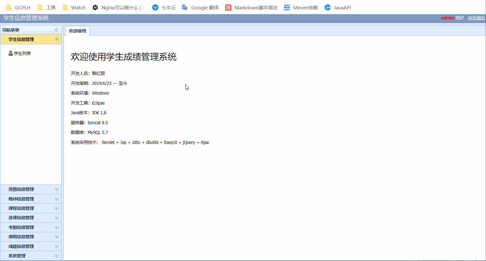

[StudentManager](https://github.com/LiLiLiLaLa/Project/tree/master/StudentManagerWeb)

简介：一个基于JavaWeb的学生信息管理系统，用来实现学生信息、老师信息、课程信息等的增删查改操作，支持普通用户和管理员身份

 

意义：

1. 练习使用Servlet+JSP的开发模式

2. 熟悉软件项目三层模型开发流程

3. 练习使用JDBC操作数据库

4. 学习EasyUI的使用

 

使用技术：

1.后台使用技术：Servlet + Jsp + Jdbc + dbutils + Ajax

2.界面实现使用：EasyUI + jQuery

3.数据库使用：MySQL 5.7

项目效果：

